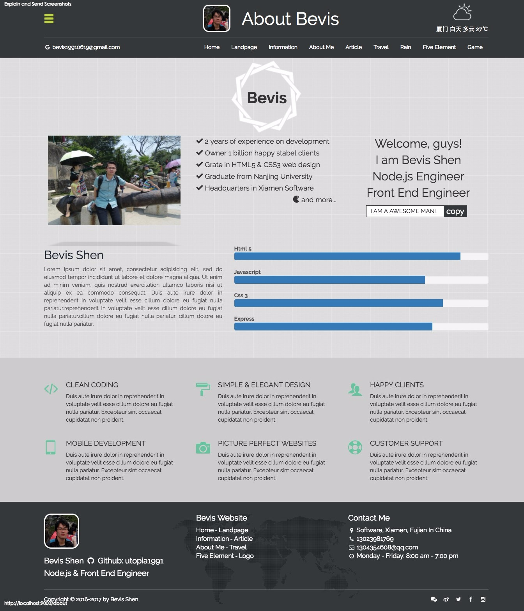
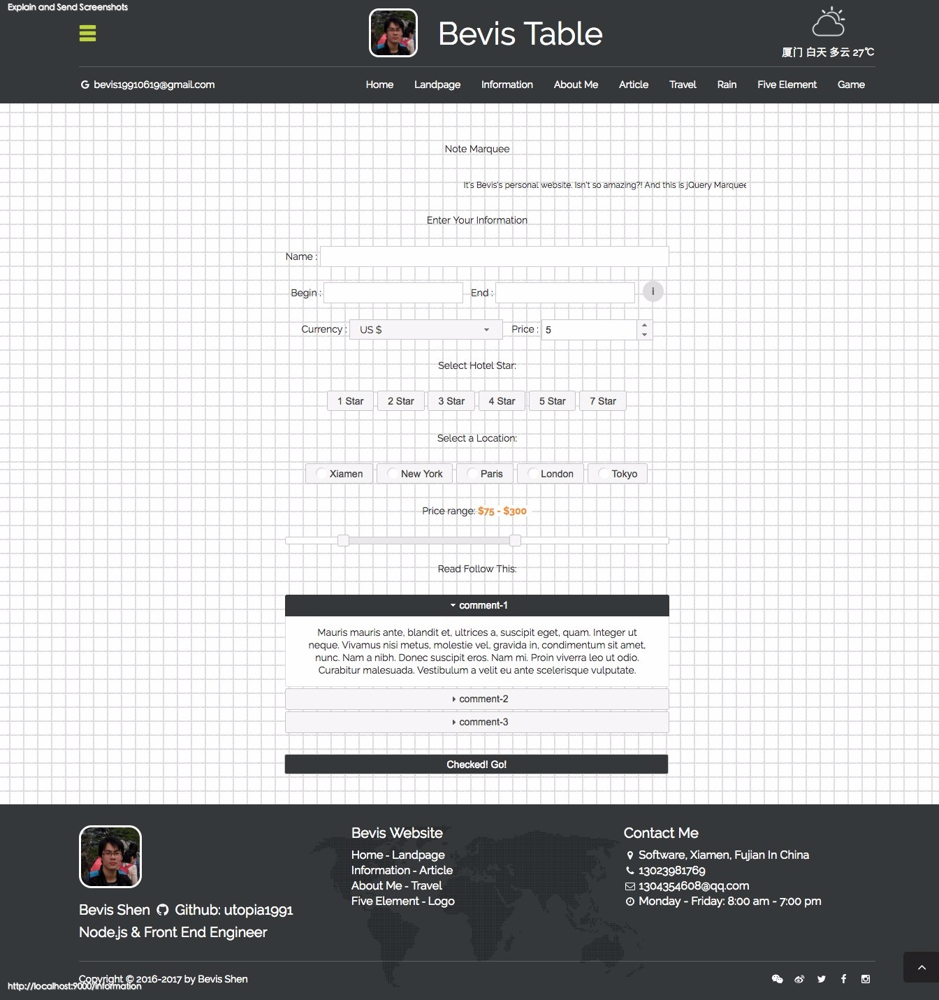

## Bevis Shen - web

> My Name Is Bevis Shen, 这个网站是我平时学习新技术，或者看到什么好玩的东东的时候就杂糅到这个我制作的网站里面，整个网站结合了 node.js, express, mongoose, mongodb, hbs, bootstrap, jQuery-UI, gulp, Eslint 等自己边学边用的东西，网站的主题还没想好，主要是想把学习的一些记录下来，Just For Practice

> My name is Bevis Shen, this is my personal web page(for node.js, hbs,bootstrap, jQuery-UI, express, gulp, Eslint and so on), you can follow my [Github](https://github.com/utopia1991)

## Installing Dependent Packages

To install the node packages, and also keep them updated, execute the following command while in the server root directory.

```
> npm i
```

## Running the server

```
> npm start
```

## Running the server in production

```
> node index.js
```

## Run ESLint on any file or directory like this:

```
> $ ./node_modules/.bin/eslint filepath.js
```







## Server Port in dev with browser-sync

```
> localhost:3000
```

## Server Port in production

```
> localhost:2000
```
